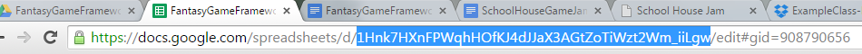

#FANTASY GAME FRAMEWORK

The "Fantasy Game Framework" template is a educational gamification tool to help teachers track points. Think of it like a classroom wall that automatically updates with only a spreadsheet update from the teacher. The teacher enters points for each student for anything they approve ( for example, turning in assignments or interacting with the subject creatively ) and then the website will display those points weekly as a leaderboard. The students can even do this on teams and get bonus points or steal points per team.

**Setup at the start of the quarter:**

*(These rules must be done for each instance of the game you want to run concurrently.)*

Setting up the framework

1. Make copy of "[FantasyGameFramework](https://docs.google.com/spreadsheets/d/1Hnk7HXnFPWqhHOfKJ4dJJaX3AGtZoTiWzt2Wm_iiLgw/edit?usp=sharing)". You probably want to call it "ClassName-SectionName," filling in class name for you class name and section name for the section name, but the name can be anything. Keep this open because you'll need the URL in the next step. 

2. In your new spreadsheet, go to "File->Publish to Web." This will make the document public so that others can view, but not modify, the content. The content is only modifiable from the Google Drive account that created the file.

3. In your copied spreadsheet highlight the ID from the URL. The screenshot below show which part of the URL is your **id**.

    1. Paste that id into the end of this address "http://ultrarat.github.io/SchoolHouseJamFantasyGameFramework/?spreadsheet_id=**<id>**" so it should end up something that looks like this example: [http://ultrarat.github.io/SchoolHouseJamFantasyGameFramework/?spreadsheet_id=1FZRdBHB_vE_OqBq_NpHyDg__PebF7_lD6hy1FGP4XLM](http://ultrarat.github.io/SchoolHouseJamFantasyGameFramework/?spreadsheet_id=1FZRdBHB_vE_OqBq_NpHyDg__PebF7_lD6hy1FGP4XLM)  but with your ID to read from your spreadsheet. 

    2. Keep this address. It will be the link you visit to view the spreadsheet data every week.

**INITIAL SPREADSHEET SET-UP at the start of the quarter:**

1. Go to the first worksheet of the spreadsheet, "**StudentInfo.**" Delete students until you have the correct amount of students for you class. Replace the placeholder text with their real names and teams. Order does not matter.

2. Now go to the second worksheet, "**TeamInfo**" and fill in the team names, once again deleting surplus teams. *These team names must match the ones you put for the student names.*

3. At long last, go to the third worksheet, "**GameInfo.**" These are settings that you can customize to personalize the website text for you class.

**WEEKLY SPREADSHEET MAINTENANCE:**

1. *OVER THE WEEKEND:* Go to the "**StudentInfo**" worksheet.** **Fill in the amount of points your students got that week from whatever points you're giving them (assessments, bonuses, etc)

2. *ON MONDAY: *Ask the winning team what they would like to do. Remember their **choice**. Then, go to the "**TeamInfo**" spreadsheet. Find the column labeled "**x actions descriptions**," where **x** is the current week of the game. In this column, locate the cells of the teams affected by the** choice**. Enter a brief description of what happened in the appropriate cells. (NOTE: This does not affect the game, it is for personal record-keeping.)

3. Then, move one column to the right to "**x points changed**." For each affected team in that column, enter the change of points the **choice** inflicts upon them (ex. +10, -10). If the **choice** was not point-related but shield-related, go to the third column entitled "**Shield Inventory**" and adjust the values accordingly.

4. If you have time:: Return to the "**StudentInfo**" spreadsheet. Massage your temples to get your creative juices flowing. Then, locate the **flavor text cell** for the current week, and enter some appropriate text for the week. This text should remind the students of which team just won and what action they took. However, this is also your chance to respond to and play off of whatever class dynamics might be taking place.

    1. *Sample: The dastardly Raplapla Guild has raided the amicable Papillon Guild, taking 500 of their coins! Utterly ruthless. Please, someone, put them in their place.*

5. For each class to see the data just show the the site on "http://ultrarat.github.io/SchoolHouseJamFantasyGameFramework/?spreadsheet_id=**<id>**" This website will show the students and teams sorted by their weekly score. The students can even [bookmark this on their phone](http://www.icaew.com/en/adding-an-iphone-shortcut) if they want to access it later if you post the address somewhere for them.

**AT THE END OF THE QUARTER:**

1. You can view the whole game's overview sorted by total points (instead of weekly) by going to: "http://ultrarat.github.io/SchoolHouseJamFantasyGameFramework/?spreadsheet_id=**<id>**&sortOn=total"

    1. Feel free to rearrange the teams as you see which where the highest performers consistently.

**Example of a game in progress can be shown here**:

spreadsheet data: [https://docs.google.com/spreadsheets/d/1FZRdBHB_vE_OqBq_NpHyDg__PebF7_lD6hy1FGP4XLM](https://docs.google.com/spreadsheets/d/1FZRdBHB_vE_OqBq_NpHyDg__PebF7_lD6hy1FGP4XLM) 

frontend: [http://ultrarat.github.io/SchoolHouseJamFantasyGameFramework/?spreadsheet_id=1FZRdBHB_vE_OqBq_NpHyDg__PebF7_lD6hy1FGP4XLM](http://ultrarat.github.io/SchoolHouseJamFantasyGameFramework/?spreadsheet_id=1FZRdBHB_vE_OqBq_NpHyDg__PebF7_lD6hy1FGP4XLM)

**Other resources**:

If you don't need something so personalized and want the students to track themselves check out "Chore Wars" or "HabitRPG." for an off-the-shelf gamification solution.

**If you want to contribute,  have found a bug, or just want more info:**

Project code: [https://github.com/UltraRat/SchoolHouseJamFantasyGameFramework](https://github.com/UltraRat/SchoolHouseJamFantasyGameFramework)

E-mail: [MollyAJameson@gmail.com](mailto:MollyAJameson@gmail.com)

